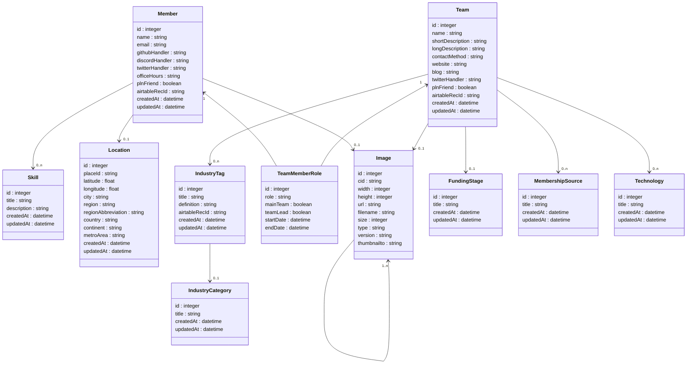

# Data Model

```mermaid
classDiagram
    direction TB

    Member --> "0..n" Skill
    Member --> "0..1" Location
    Member --> "0..1" Image
    Member "1" <-- TeamMemberRole
    Team "1" <-- TeamMemberRole
    IndustryTag --> "0..1" IndustryCategory
    Team --> "0..n" IndustryTag
    Team --> "0..1" FundingStage
    Team --> "0..1" Image
    Team --> "0..n" MembershipSource
    Team --> "0..n" Technology
    Image --> "1..n" Image


    class Team {
      id : integer
      name : string
      shortDescription : string
      longDescription : string
      contactMethod : string
      website : string
      blog : string
      twitterHandler : string
      plnFriend : boolean
      airtableRecId : string
      createdAt : datetime
      updatedAt : datetime
    }

    class TeamMemberRole {
      id : integer
      role : string
      mainTeam : boolean
      teamLead : boolean
      startDate : datetime
      endDate : datetime
    }


    class FundingStage {
      id : integer
      title : string
      createdAt : datetime
      updatedAt : datetime
    }


    class MembershipSource {
      id : integer
      title : string
      createdAt : datetime
      updatedAt : datetime
    }


    class IndustryTag {
      id : integer
      title : string
      definition : string
      airtableRecId : string
      createdAt : datetime
      updatedAt : datetime
    }


    class IndustryCategory {
      id : integer
      title : string
      createdAt : datetime
      updatedAt : datetime
    }

    class Technology {
      id : integer
      title : string
      createdAt : datetime
      updatedAt : datetime
    }

    class Member {
      id : integer
      name : string
      email : string
      githubHandler : string
      discordHandler : string
      twitterHandler : string
      officeHours : string
      plnFriend : boolean
      airtableRecId : string
      createdAt : datetime
      updatedAt : datetime
    }

    class Skill {
      id : integer
      title : string
      description : string
      createdAt : datetime
      updatedAt : datetime
    }


    class Location {
      id : integer
      placeId : string
      latitude : float
      longitude : float
      city : string
      region : string
      regionAbbreviation : string
      country : string
      continent : string
      metroArea : string
      createdAt : datetime
      updatedAt : datetime
    }

    class Image {
        id : integer
        cid : string
        width : integer
        height : integer
        url : string
        filename : string
        size : integer
        type : string
        version : string
        thumbnailto : string
    }
```
