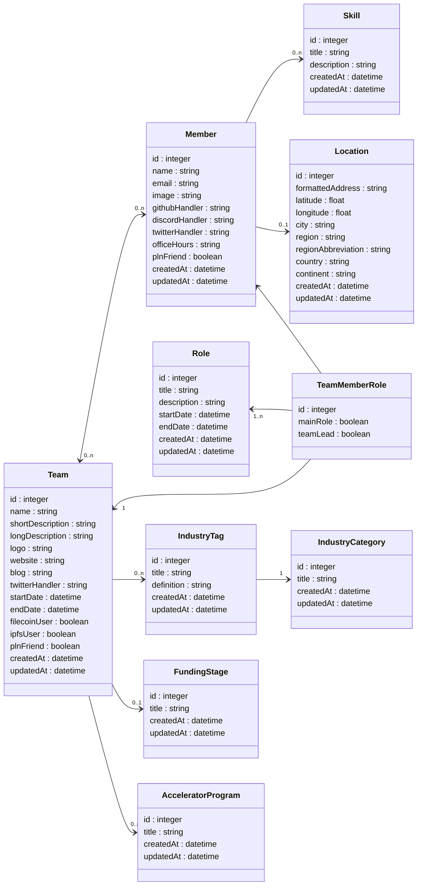

# Data Model

```mermaid
classDiagram
    direction LR

    Team "0..n" <--> "0..n" Member
    Member --> "0..n" Skill
    Member --> "0..1" Location
    Role "1..n" <-- TeamMemberRole
    Member "1" <-- TeamMemberRole
    Team "1" <-- TeamMemberRole
    IndustryTag --> "1" IndustryCategory
    Team --> "0..n" IndustryTag
    Team --> "0..1" FundingStage
    Team --> "0..n" AcceleratorProgram


    class Team {
      id : integer
      name : string
      shortDescription : string
      longDescription : string
      logo : string
      website : string
      blog : string
      twitterHandler : string
      startDate : datetime
      endDate : datetime
      filecoinUser : boolean
      ipfsUser : boolean
      plnFriend : boolean
      createdAt : datetime
      updatedAt : datetime
    }

    class TeamMemberRole {
       id : integer
       mainRole : boolean
       teamLead : boolean
    }


    class FundingStage {
      id : integer
      title : string
      createdAt : datetime
      updatedAt : datetime
    }


    class AcceleratorProgram {
      id : integer
      title : string
      createdAt : datetime
      updatedAt : datetime
    }


    class IndustryTag {
      id : integer
      title : string
      definition : string
      createdAt : datetime
      updatedAt : datetime
    }


    class IndustryCategory {
      id : integer
      title : string
      createdAt : datetime
      updatedAt : datetime
    }

    class Member {
      id : integer
      name : string
      email : string
      image : string
      githubHandler : string
      discordHandler : string
      twitterHandler : string
      officeHours : string
      plnFriend : boolean
      createdAt : datetime
      updatedAt : datetime
    }


    class Role {
      id : integer
      title : string
      description : string
      startDate : datetime
      endDate : datetime
      createdAt : datetime
      updatedAt : datetime
    }


    class Skill {
      id : integer
      title : string
      description : string
      createdAt : datetime
      updatedAt : datetime
    }


    class Location {
      id : integer
      formattedAddress : string
      latitude : float
      longitude : float
      city : string
      region : string
      regionAbbreviation : string
      country : string
      continent : string
      createdAt : datetime
      updatedAt : datetime
    }
```
