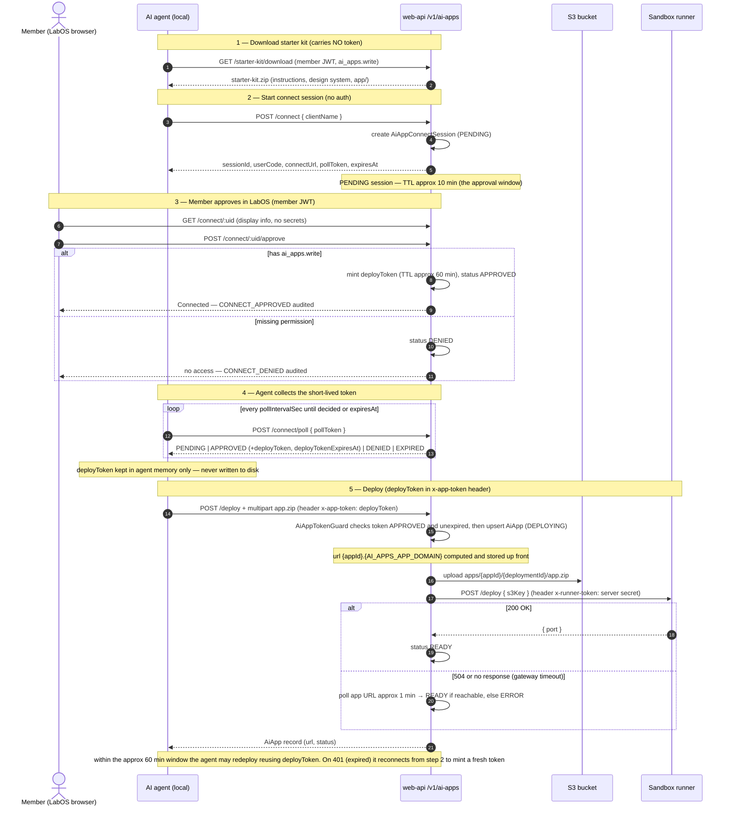

# AI Apps (PL Infra)

> Status: **POC / happy-path only.** Lives under the PL Infra navigation hub.

PLN members "vibe-code" a small web app locally with an AI assistant (Claude Code, Cursor, …) and have the agent deploy it to the PLN **sandbox runner**. The backend tracks every app and its deploy status so PL Infra users can browse and open the live apps from a dashboard (UI built later, in `pln-directory-portal-v2`).

## User flow

1. A member with `ai_apps.write` opens the AI Apps dashboard and downloads the **starter kit** ZIP. The kit carries **no token**.
2. They unzip it into their AI coding tool and describe what to build. The agent edits files under `app/`, reusing the bundled **PL Design System** (`pl-design-system/`) for on-brand UI instead of hand-rolling components.
3. When ready, the member says "deploy". Before the **first** deploy the agent proposes a human-friendly **name** and short **description** for the app and waits for the member to approve (or revise) them — kits ≥1.5, see "Editable metadata & one-pager PRD" below. The agent has no stored token, so it **starts a LabOS connect session**, gives the member a link + confirmation code to open and approve, then polls until it receives a **short-lived deploy token**.
4. The agent packages `app/` and POSTs to our deploy endpoint with that short-lived token. The backend proxies the deploy to the sandbox runner, stores the result, and the app shows up on the dashboard with its live URL. After the first successful deploy the agent offers an optional **one-pager PRD**; if the member wants one, the agent drafts it, gets approval, and saves it through the metadata endpoint — no redeploy.
5. **Apps that need runtime secrets** (API keys etc.) take a detour: instead of deploying, the agent registers a **draft** (same upload + the required env var *names*), then hands the member a LabOS link. The member enters the secret *values* there and clicks **Deploy** — see "Draft apps & runtime secrets" below.

## Architecture

The end-to-end flow, with the **auth credentials and their lifetimes** called out (kit = no token, connect session ≈ 10 min, deploy token ≈ 60 min):



The agent only ever holds a **short-lived deploy token** it obtained through the connect flow — it ships the app ZIP to us and we handle the rest. **AWS credentials and the runner token both stay server-side**: the backend uploads the ZIP to S3 (reusing `AwsService`, the same uploader as member images) and calls the runner. The S3 key is derived as `apps/<appId>/<deploymentId>/app.zip`, and the app is served at `https://<appId>.<AI_APPS_APP_DOMAIN>` (e.g. `<appId>.dev.plnetwork.io` on Dev, `<appId>.prod.plnetwork.io` on Prod).

## Connect flow (deploy auth)

The starter kit no longer ships a long-lived token. When the agent needs to deploy, it runs a device-authorization–style handshake so the credential is short-lived and minted only after the member proves `ai_apps.write` in LabOS:

1. **Start** — the agent POSTs `/v1/ai-apps/connect` (no auth). The backend creates an `AiAppConnectSession` (`PENDING`, ~10 min TTL) and returns `sessionId`, a human-readable `userCode`, a `connectUrl` (the LabOS approval page), a secret `pollToken`, and `pollIntervalSec`.
2. **Approve** — the member opens `connectUrl` in LabOS (`/pl-infra/ai-apps/connect?session=<sessionId>`), signs in, confirms the `userCode` matches what the agent shows, and clicks **Approve**. The page calls `POST /v1/ai-apps/connect/:uid/approve`. The handler resolves the member and checks `ai_apps.write`: on success it mints a short-lived `deployToken` (~60 min) bound to the session (`APPROVED`); without the permission it marks the session `DENIED`. Both outcomes are written to the audit log (`CONNECT_APPROVED` / `CONNECT_DENIED`).
3. **Collect** — the agent polls `POST /v1/ai-apps/connect/poll` with its `pollToken`. While `PENDING` it keeps polling; on `APPROVED` it receives the `deployToken` (+ `deployTokenExpiresAt`); on `DENIED`/`EXPIRED` it stops.
4. **Deploy** — the agent uses the `deployToken` in `x-app-token` for `POST /v1/ai-apps/deploy`. It may redeploy until the token expires; afterwards it reconnects to mint a new one.

The `deployToken` is held in agent memory only and never written into the kit, so the starter-kit folder grants nothing on its own.

## Endpoints

| Method | Path                              | Auth                         | Permission        | Purpose |
|--------|-----------------------------------|------------------------------|-------------------|---------|
| GET    | `/v1/ai-apps`                     | `UserTokenCheckGuard`+`RbacGuard` | `ai_apps.read`/`write` | List apps with owner + status (excludes `DELETED`) |
| GET    | `/v1/ai-apps/events`             | `UserTokenCheckGuard`+`RbacGuard` | `ai_apps.read`/`write` | Event log (audit feed); `?appUid=` to scope, `?limit=` (default 100, max 500) |
| GET    | `/v1/ai-apps/me`                 | `UserAccessTokenValidateGuard`+`RbacGuard` (Bearer **or** `authToken` cookie) | `ai_apps.read`/`write` | Member context for deployed apps: the signed-in member's public identity (see below) |
| GET    | `/v1/ai-apps/:uid`               | `UserTokenCheckGuard`+`RbacGuard` | `ai_apps.read`/`write` | Single app detail |
| GET    | `/v1/ai-apps/:uid/events`        | `UserTokenCheckGuard`+`RbacGuard` | `ai_apps.read`/`write` | Full event/status history for one app (404 if app missing) |
| GET    | `/v1/ai-apps/:uid/live`          | `UserTokenCheckGuard`+`RbacGuard` | `ai_apps.read`/`write` | Liveness probe: one server-side reachability check of the app URL → `{ live }`; gateway timeouts AND 404 count as down (the ingress 404s until a first deploy's route is ready). The LabOS detail page polls it so the iframe never shows a raw gateway/404 error |
| PATCH  | `/v1/ai-apps/:uid`               | `UserTokenCheckGuard`+`RbacGuard` | `ai_apps.write`   | Edit display metadata (`name`/`description`/`prd`) without redeploying; JSON **or** multipart (`file` = Markdown/HTML PRD, stored in S3) |
| POST   | `/v1/ai-apps/:uid/prd`           | `UserTokenCheckGuard`+`RbacGuard` | `ai_apps.write`   | File-only PRD upload from the LabOS dashboard (multipart `file`, `.md`/`.html`) — no redeploy |
| PATCH  | `/v1/ai-apps/:uid/agent`         | `AiAppTokenGuard` (`x-app-token`) | — (token = member, **owner only**) | Agent metadata edit: JSON `{ name?, description?, prd? }`; how the starter kit saves approved names/descriptions and one-pager PRDs |
| POST   | `/v1/ai-apps/:uid/feedback`      | `UserTokenCheckGuard`+`RbacGuard` | `ai_apps.read`/`write` | Submit free-text feedback on an app (multiple entries per member allowed) |
| GET    | `/v1/ai-apps/:uid/feedback`      | `UserTokenCheckGuard`+`RbacGuard` | `ai_apps.read`/`write` + creator/directory-admin (checked in service) | All feedback for one app, newest first, with submitter info |
| GET    | `/v1/ai-apps/starter-kit/download` | `UserTokenCheckGuard`+`RbacGuard` | `ai_apps.write`   | Stream the starter-kit ZIP (no token inside) |
| POST   | `/v1/ai-apps/connect`            | none (agent)                  | —                 | Start a connect session; returns `connectUrl`/`userCode`/`pollToken` |
| POST   | `/v1/ai-apps/connect/poll`       | none (agent, `pollToken` in body) | —             | Poll a session; returns the `deployToken` once `APPROVED` |
| GET    | `/v1/ai-apps/connect/:uid`       | `UserTokenCheckGuard`         | —                 | Connect-session display info for the LabOS page (no secrets) |
| POST   | `/v1/ai-apps/connect/:uid/approve` | `UserTokenCheckGuard`       | `ai_apps.write` (checked in service) | Approve → mint deploy token; else mark `DENIED` (both audited) |
| POST   | `/v1/ai-apps/deploy`              | `AiAppTokenGuard` (`x-app-token` = short-lived deploy token) | — (token = member) | Upload app ZIP → S3 → sandbox runner |
| POST   | `/v1/ai-apps/draft`               | `AiAppTokenGuard` (`x-app-token`) | — (token = member) | Register a DRAFT app that needs runtime secrets: upload ZIP → S3, store required env var names; nothing deployed yet |
| POST   | `/v1/ai-apps/:uid/deploy`         | `UserTokenCheckGuard`+`RbacGuard` | `ai_apps.write` + creator/directory-admin (checked in service) | Member-triggered deploy: save submitted secret values to the runner, validate required vars, deploy the stored bundle |
| DELETE | `/v1/ai-apps/:uid`               | `UserTokenCheckGuard`+`RbacGuard` | `ai_apps.write`   | Tear down on the runner → mark `DELETED` |

### Deploy request

`POST /v1/ai-apps/deploy` is `multipart/form-data` with the app ZIP plus metadata fields:

```bash
curl -X POST "$AI_APPS_DEPLOY_ENDPOINT" \
  -H "x-app-token: $DEPLOY_TOKEN" \
  -F "appId=my-leaderboard" \
  -F "name=My Leaderboard" \
  -F "description=A small leaderboard demo" \
  -F "deploymentId=deploy-1718900000" \
  -F "kitVersion=1.5" \
  -F "file=@app.zip;type=application/zip"
```

`name`/`description` are member-facing: kits ≥1.5 send values the member explicitly approved (and resend the same values on redeploys — see "Editable metadata & one-pager PRD").

`kitVersion` is optional (kits ≥1.4 send the value from their `pln-app.config.json`) and is stored on the app so we know which kit produced the last upload — older kits send nothing and the column goes/stays null. The same field exists on `POST /v1/ai-apps/draft`, and the `KIT_DOWNLOADED` audit event records the downloaded version in `message`.

Two more debugging columns describe the agent behind the last upload, both self-reported: `agentClient` is copied **server-side** from the connect session's `clientName` (the deploy token is bound to the session, so no extra field is needed — the kit now tells agents to send their real tool name instead of a hardcoded "Claude Code"), and `agentModel` is an optional free-form multipart field (e.g. `claude-sonnet-4-5`) the kit tells the agent to include when it knows its model. Like `kitVersion`, they reflect the LAST upload and are cleared when a client sends nothing.

The backend uploads the ZIP to `s3://<AI_APPS_S3_BUCKET>/apps/<appId>/<deploymentId>/app.zip`, then calls the runner with that `s3Key`. Response is the stored `AiApp` record (status `READY` with `url`/`host`/`port`, or `ERROR` with `notes`).

**Deterministic URL:** the sandbox host is always `<appId>.<AI_APPS_APP_DOMAIN>` (env-configurable: `dev.plnetwork.io` on Dev, `prod.plnetwork.io` on Prod), so `url`/`httpUrl`/`host` are computed from `appId` and stored on the record **at deploy start** (status `DEPLOYING`) — the link exists before the runner finishes. For `appId` `test-hello-01` on Prod the URL is `https://test-hello-01.prod.plnetwork.io`.

**Timeout handling:** the runner build can exceed the edge (Cloudflare) timeout and return `504`/`524` even though the deploy actually completes. On a gateway timeout (or no response), the backend does **not** fail blindly — it polls the app URL (`buildAppUrl(appId)`) for ~6 min by default (`AI_APPS_VERIFY_ATTEMPTS` × `AI_APPS_VERIFY_INTERVAL_MS`, default 24 × 8s, env-overridable; sized to cover the pod-up → domain-registration gap observed at 1–5 min) and marks the app `READY` if it becomes reachable (any non-gateway HTTP status counts, including `404` from the app; Cloudflare's `530` origin-DNS error counts as not-yet-reachable). Only if it stays unreachable — or the runner returns a non-timeout error (e.g. `400`/auth) — is it marked `ERROR` / `DEPLOY_FAILED`. This prevents false failures for slow-but-successful deploys.

**Stuck deploys & manual retry:** deploys run synchronously inside the API process, so a legitimate one settles to `READY`/`ERROR` within minutes. An app still `DEPLOYING` after `AI_APPS_DEPLOY_STUCK_MINUTES` (default 15, env-overridable) is **stuck** — the API died mid-deploy or the runner hung — and is settled lazily on read: `GET /v1/ai-apps` and `GET /v1/ai-apps/:uid` flip such rows to `ERROR` with an explanatory `notes` and a `DEPLOY_FAILED` event (the update is conditioned on the row still being `DEPLOYING`, so a concurrently-settling deploy wins). The owner or a directory admin can then **retry** via the member deploy endpoint (`POST /v1/ai-apps/:uid/deploy`, empty body for apps without secrets) — it redeploys the bundle stored at `s3Key`, so it recovers from runner/backend outages without the agent re-uploading; if the app *itself* is broken the retry fails again with the runner error in `notes`, and the fix is to redeploy from the agent. While a **fresh** (non-stuck) deploy is in flight the endpoint returns `409` to prevent concurrent deploys. The LabOS detail page shows a status card for `ERROR` (error notes + Retry button for the creator/admin) and `DEPLOYING` (auto-refreshing progress), and the dashboard cards carry `Deploy failed` / `Deploying` badges.

## Draft apps & runtime secrets

Apps that read secrets from the environment (`OPENAI_API_KEY`, credentialed URLs, …) must never ship the values in the ZIP, and the agent must never see them. The **draft flow** splits responsibilities: the agent declares which env var *names* the app needs; the member supplies the *values* in LabOS; the backend forwards the values straight to the sandbox runner's secret store (they are **never persisted in our DB** — only the names are tracked, in `requiredEnvVars` / `providedEnvVars`).

1. **Register (agent, deploy token)** — `POST /v1/ai-apps/draft`, same multipart shape as deploy plus `requiredEnvVars` (JSON array or comma-separated string; names must be `UPPER_SNAKE_CASE`):

```bash
curl -X POST "$AI_APPS_DRAFT_ENDPOINT" \
  -H "x-app-token: $DEPLOY_TOKEN" \
  -F "appId=my-ai-helper" \
  -F "name=My AI Helper" \
  -F "description=Chat helper that calls OpenAI" \
  -F "deploymentId=draft-1751900000" \
  -F 'requiredEnvVars=["OPENAI_API_KEY","SUPABASE_URL"]' \
  -F "file=@app.zip;type=application/zip"
```

The ZIP goes to S3 as usual, the app is upserted with status **`DRAFT`** (`s3Key` + `requiredEnvVars` stored, `DRAFT_CREATED` audited), and the response carries `appPageUrl` — the LabOS app detail page (`/pl-infra/ai-apps/<uid>`) — plus `missingEnvVars`. The agent gives `appPageUrl` to the member. Nothing runs yet; a draft is not live and not iframe-ready, and the dashboard shows it with the distinct `DRAFT` status.

2. **Deploy (member, LabOS)** — the member opens the page, enters the values, and clicks Deploy, which calls:

```bash
curl -X POST "https://api.plnetwork.io/v1/ai-apps/<uid>/deploy" \
  -H "Authorization: Bearer $MEMBER_JWT" \
  -H "Content-Type: application/json" \
  -d '{"secrets":{"OPENAI_API_KEY":"sk-…","SUPABASE_URL":"https://…"}}'
```

The backend (creator or directory admin only) first checks every name in `requiredEnvVars` has a value — stored earlier or submitted now — and otherwise rejects with a 400 naming the missing vars. It then saves the submitted values to the runner's secret store (`POST <AI_APPS_RUNNER_URL>/v1/projects/<AI_APPS_RUNNER_PROJECT>/secrets` with `{ appId, environment, secrets }` — merge/upsert semantics, `SECRETS_UPDATED` audited with names only) and redeploys the stored bundle through the normal runner `/deploy` proxy (status `DEPLOYING` → `READY`/`ERROR`).

3. **Update & redeploy** — the member can reopen the same page any time, change one or more values (`secrets` may be a subset — the runner merges), and Deploy again. `secrets` may also be omitted entirely to redeploy with the already-stored values. For a code update the agent re-registers the draft (same `appId`, fresh `deploymentId`); stored values stay valid.

### Delete request

`DELETE /v1/ai-apps/:uid` (member JWT, `ai_apps.write`). The backend looks up the app by `uid`, calls the runner to tear it down, then marks the record `DELETED`:

```
DELETE <AI_APPS_RUNNER_URL>/apps/<appId>
Header: x-runner-token: <server secret>
```

Flow: set status `DELETING` + log `DELETE_STARTED` → call the runner → on success clear hosting fields, set status `DELETED`, log `DELETE_SUCCEEDED`; on failure set status `ERROR` (with `notes`), log `DELETE_FAILED`, and return `502`. The `AiApp` row is **kept** (status flips to `DELETED`) so the audit trail and event history survive. Response is the updated `AiApp` record.

## Editable metadata & one-pager PRD

An app's display metadata — `name`, `description`, and an optional **one-pager PRD** (`prd`) — is editable **independently of deploys**: none of these endpoints upload a ZIP, invoke the sandbox runner, or change the app's status. Three routes (migration `20260715120000_ai_apps_editable_metadata` added the `prd` column):

- **`PATCH /v1/ai-apps/:uid`** (member JWT, `ai_apps.write`) — accepts `application/json` (`{ name?, description?, prd? }`) **or** `multipart/form-data` where an optional `file` carries a Markdown/HTML PRD (then `prd` must not also be sent in the body). Used by the LabOS edit UI.
- **`POST /v1/ai-apps/:uid/prd`** (member JWT, `ai_apps.write`) — file-only PRD upload for the dashboard.
- **`PATCH /v1/ai-apps/:uid/agent`** (`AiAppTokenGuard`, `x-app-token` deploy token) — JSON-only agent variant used by starter kits ≥1.5; unlike the member routes it is restricted to apps **owned by the connected member** (403 otherwise).

Validation: at least one field must be present; `name` 1–200 chars, `description` ≤4000 (nullable — `null` clears), `prd` ≤100,000 chars (nullable). PRD **files** must be `.md`/`.markdown`/`.html`/`.htm`, UTF-8 text (a NUL byte rejects), ≤1 MB (`AI_APPS_MAX_PRD_BYTES`). Both multipart routes are excluded from `ContentTypeMiddleware` in `app.module.ts`.

**PRD storage:** an uploaded PRD *file* goes to S3 under `ai-app-prds/<appId>/<uuid><.md|.html>` in `AI_APPS_PRD_S3_BUCKET` (defaults to `AI_APPS_S3_BUCKET`), and only the S3 key is stored in `AiApp.prd`. On every read, `withMember` maps a `prd` value starting with `ai-app-prds/` to its public URL (`AI_APPS_PRD_PUBLIC_BASE_URL` if set, else the standard S3 URL) — so the API contract is simply "`prd` holds a URL or inline content". Inline `prd` *text* (the agent route, or JSON PATCH without a file) is stored verbatim in the DB and returned as-is.

Agent example (name/description + inline Markdown one-pager):

```bash
curl -X PATCH "https://api.plnetwork.io/v1/ai-apps/<uid>/agent" \
  -H "x-app-token: $DEPLOY_TOKEN" \
  -H "Content-Type: application/json" \
  -d '{"name":"Team Availability Board","description":"See who on your team is free this week.","prd":"# Team Availability Board\n\n_See who is free this week._\n\n## Problem Statement\n…"}'
```

Dashboard PRD file upload (`.md` or `.html`):

```bash
curl -X POST "https://api.plnetwork.io/v1/ai-apps/<uid>/prd" \
  -H "Authorization: Bearer $MEMBER_JWT" \
  -F "file=@one-pager.md;type=text/markdown"
```

**Interplay with deploys:** every deploy/draft upload **overwrites** `name`/`description` with the multipart form values (the upsert has no "keep existing" path) — which is why kits ≥1.5 persist the member-approved values in `pln-app.config.json` and resend them verbatim on redeploys. Deploys never touch `prd`, so a one-pager survives any number of redeploys. Metadata edits are not audited (no `AiAppEvent` rows).

### Starter kit flow (kits ≥1.5)

The kit's `app-metadata` skill drives a propose → confirm → save workflow so the agent never publishes member-facing copy without approval:

1. **First deploy** (no `appName` saved in `pln-app.config.json`): the agent drafts a human-friendly name + 1–2 sentence description from what the app does, presents them, and waits for **explicit approval** (revising as asked). Approved values are saved to `appName`/`appDescription` in the config and sent as the deploy form's `name`/`description`.
2. **After the first successful deploy**: the agent asks once whether the member wants a one-pager PRD. If declined, nothing happens; if wanted, it synthesizes a concise Markdown one-page brief from the conversation (problem, solution, features, how to use, goals/OKR, success metrics, out of scope — see the kit's `app-metadata` skill), gets approval, and saves it via `PATCH …/:uid/agent` — no new ZIP, no redeploy. Dashboard uploads may still be `.md` or `.html`.
3. **Redeploys**: the saved `appName`/`appDescription` are resent verbatim and the propose flow is **not** re-run (it would otherwise revert approved metadata, since deploys overwrite it).
4. **Metadata changes on an existing app** (rename, description edit, PRD add/update/remove): same propose → confirm → save flow through the metadata endpoint, using the `appUid` the kit saved from the deploy/draft response (`metadataEndpoint` in the config is a template with a `{appUid}` placeholder). A metadata-only session still gets its short-lived token through the normal connect flow.

## Member context (signed-in user → deployed app)

Deployed apps can personalize for the member using them (greet by name, tag
feedback, adapt behavior). `GET /v1/ai-apps/me` returns the signed-in member's
**public** directory identity:

```json
{
  "member": {
    "uid": "…", "name": "Ada Lovelace", "image": "https://…/ada.png",
    "location": { "city": "London", "country": "United Kingdom", "continent": "Europe" },
    "skills": ["Engineering"],
    "teams": [{ "uid": "…", "name": "Protocol Labs", "role": "Engineer", "mainTeam": true, "teamLead": false }]
  }
}
```

The payload deliberately carries **no contact info** — no `email` and no `officeHours` link. Apps get an identity to personalize with, never a channel to reach the member.

How it works — no app-side login and no new token flow:

- LabOS writes the login cookies (`authToken` etc.) with `domain=COOKIE_DOMAIN`,
  a shared parent domain (on Dev: `.dev.plnetwork.io`), so a deployed app at
  `<appId>.<AI_APPS_APP_DOMAIN>` receives the cookie on its **own** origin. The
  kit's snippet reads it from `document.cookie` (URL-decode + strip the JSON
  quotes) and sends it to `/me` as `Authorization: Bearer`.
- ⚠️ `credentials: 'include'` alone is NOT reliable: the cookie domain covers the
  app hosts but not necessarily the API host (on Dev the API lives at
  `dev-directory.plnetwork.io`, a **sibling** of `dev.plnetwork.io`, so the
  browser never attaches the cookie → guaranteed 401 with only PostHog cookies
  in the request). Bearer-from-cookie only requires the cookie to reach the app
  host, which is exactly what `COOKIE_DOMAIN` guarantees.
- Unlike the other dashboard endpoints, `/me` uses `UserAccessTokenValidateGuard`,
  which accepts the token from the `Authorization: Bearer` header **or** the
  `authToken` cookie (`extractTokenFromRequest`), then introspects it against the
  auth service. `RbacGuard` enforces `ai_apps.read`.
- Access outcomes: guest/signed-out → `401` (no token); signed-in member without
  AI Apps access → `403`; otherwise the curated profile above. The kit instructs
  apps to treat any non-200 as "not signed in" and keep working un-personalized.
- CORS already covers app origins with credentials (the dev list matches
  `*.dev.plnetwork.io`, the prod list `*.plnetwork.io`).
- The response is assembled in `AiAppsService.getMemberContext` from curated
  public fields only — extend **there** if apps may read more PLN data later
  (the "light MCP" extension point); never point apps at internal endpoints.
- The kit's `pln-app.config.json` carries the URL as `memberContextEndpoint`,
  and `.claude/skills/pln-member-context/SKILL.md` tells the agent how to use it
  (client-side fetch, handle 401/403/local-dev gracefully, personalization only —
  never auth for sensitive actions, never store/log tokens).

## Data model

```prisma
enum AiAppStatus { IN_DEVELOPMENT  DRAFT  DEPLOYING  READY  ERROR  DELETING  DELETED }

model AiApp {
  uid          String  @unique
  memberUid    String          // owner (no FK relation; resolved in service)
  appId        String          // business key, unique per owner
  name         String
  description  String?
  prd          String?         // one-pager PRD: inline Markdown/HTML, or an S3 key (ai-app-prds/…) returned as a public URL
  status       AiAppStatus @default(IN_DEVELOPMENT)
  notes        String?         // error detail on failed deploys
  url / httpUrl / host / port  // hosting details from the runner
  deploymentId String?
  s3Key        String?         // last uploaded bundle (lets a member redeploy a draft)
  requiredEnvVars String[]     // env var NAMES the agent declared (draft flow)
  providedEnvVars String[]     // NAMES the member gave values for — values live only on the runner
  kitVersion   String?         // starter-kit version behind the last agent upload (null = pre-1.4 kit)
  agentClient  String?         // AI tool from the connect session's clientName (e.g. "Claude Code")
  agentModel   String?         // model the agent reported for the last upload (self-reported)
  @@unique([memberUid, appId])
}

enum AiAppConnectStatus { PENDING  APPROVED  DENIED  EXPIRED }

model AiAppConnectSession {     // short-lived connect handshake (replaces AiAppToken)
  uid                  String  @unique   // sessionId in the connect URL
  userCode             String  @unique   // human-readable confirmation code
  clientName           String?           // e.g. "Claude Code" (shown on the page)
  pollToken            String  @unique   // agent's secret to poll/collect the token
  status               AiAppConnectStatus @default(PENDING)
  memberUid            String?           // bound on approval
  deployToken          String? @unique   // short-lived token minted on approval (x-app-token)
  deployTokenExpiresAt DateTime?
  expiresAt            DateTime          // PENDING window (login deadline)
  approvedAt           DateTime?
  lastUsedAt           DateTime?         // last deploy with the token
}

enum AiAppEventType {
  KIT_DOWNLOADED  CONNECT_APPROVED  CONNECT_DENIED
  DRAFT_CREATED   SECRETS_UPDATED
  DEPLOY_STARTED  DEPLOY_SUCCEEDED  DEPLOY_FAILED
  DELETE_STARTED  DELETE_SUCCEEDED  DELETE_FAILED
}

model AiAppFeedback {         // free-text feedback from the app detail page
  uid       String @unique
  appUid    String             // AiApp.uid (no FK relation, matching the other POC tables)
  memberUid String             // submitter; may submit multiple entries per app
  text      String
  createdAt DateTime @default(now())
}

model AiAppEvent {            // append-only audit log — one row per event, never updated
  uid          String @unique
  memberUid    String         // who triggered it
  type         AiAppEventType
  appUid       String?        // set for deploy events (null for KIT_DOWNLOADED)
  appId        String?
  deploymentId String?
  message      String?        // e.g. error detail on DEPLOY_FAILED, url on success
  createdAt    DateTime @default(now())
}
```

Apps are **lazy-created on first deploy** — there is no registration form. (A draft registration counts: it upserts the same record with status `DRAFT`.)

**Response shape:** every AI Apps endpoint (`list`, detail, `events`, and the `deploy` result) returns the owner as `member: { uid, name, image }` and omits the raw `memberUid` (the uid lives in `member.uid`, so it isn't duplicated). `memberUid` remains a column on the DB models above. The detail endpoint additionally returns `canManage` — whether the requesting member is the creator or a directory admin — computed server-side so the UI never compares member uids from a possibly stale login cookie.

`AiApp.status` is the current-state snapshot for the dashboard; `AiAppEvent` is the immutable event flow. A row is appended on kit download (`KIT_DOWNLOADED`), on each connect approval/denial (`CONNECT_APPROVED` / `CONNECT_DENIED` — the `userCode` is recorded in `message`), at the start of every deploy (`DEPLOY_STARTED`) and its outcome (`DEPLOY_SUCCEEDED` / `DEPLOY_FAILED`), and likewise for deletes (`DELETE_STARTED` → `DELETE_SUCCEEDED` / `DELETE_FAILED`). Event logging never throws — a logging failure won't break a download, connect, deploy, or delete.

## RBAC

- `ai_apps.read` — view the dashboard (list/detail) and submit feedback on an app.
- `ai_apps.write` — download the starter kit and deploy.

Reading an app's feedback list additionally requires being the app's creator or a
directory admin (`isDirectoryAdmin`) — enforced in `AiAppsService.listFeedback`,
not by a separate permission.

Both are seeded in migration `20260623120000_ai_apps` and attached to the **PL Infra Team** policy (`pl_infra_team_pl_internal`), and registered in `access-control-v2.constants.ts` + `access-control-v2.seed.ts`.

## Starter kit ZIP

Built by `AiAppsStarterKitService` — text files are generated in-memory; the PL
Design System is embedded as a curated folder (see below):

```
README.md                                      human quick-start
CLAUDE.md / AGENTS.md                          agent build + deploy instructions
.claude/skills/deploy-to-labs/SKILL.md         deploy skill (incl. connect flow)
.claude/skills/app-metadata/SKILL.md           propose → approve name/description + optional one-pager PRD (kits ≥1.5)
.claude/skills/pl-design-system/SKILL.md       single UI skill (components + tokens)
.claude/skills/pln-member-context/SKILL.md     how the app gets the signed-in member's identity
pln-app.config.json                            connect/deploy/draft/metadata/member-context endpoints
                                               (+ appId, appUid, approved appName/appDescription) — NO token
pl-design-system/                              curated PL Design System (files, not a nested zip)
styles/pln-theme.css                           minimal CSS-variable fallback (plain-HTML apps)
styles/FONTS.md                                Inter font guidance
app/                                           minimal runnable Node/Express scaffold
```

The kit deliberately exposes **no internal PLN APIs** — only the connect, deploy, draft, metadata, and member-context endpoints — and **no token**.

### Bundled PL Design System

Members no longer hand-roll UI. The kit ships the curated **PL Design System** as
a ready-to-use `pl-design-system/` folder (no nested zip for the agent to unpack):

```
pl-design-system/
  USAGE.md                 how to consume the system in a Next.js 14 app
  guidelines.md            design rules (retrieval order, token usage, do/don't)
  components/              React components (.tsx + SCSS modules + types)
                           primitives (Button, Input, Badge, Tabs, Table,
                           Pagination, SearchInput, …) and product components
                           (MemberCard, TeamCard, PageHeader, Sidebar, NavBar, …)
                           plus per-component specs in primitives/ and product/
  tokens/                  SCSS design tokens → CSS custom properties
  styles/                  globals.scss (reset + tokens + @font-face), media, mixins
  public/fonts/            self-hosted Inter variable font (woff2)
  patterns/ examples/      layout patterns + page-level reference compositions
```

The curated tree lives at `apps/web-api/src/ai-apps/assets/pl-design-system/`
(kit overlays: `USAGE.md`, `guidelines.kit.md`). It is registered as a build
asset in `apps/web-api/project.json`, so `nx build` copies it to
`dist/apps/web-api/ai-apps/assets/pl-design-system/`. At download time
`AiAppsStarterKitService` walks that folder into the kit ZIP. If the asset is
ever missing at runtime, the kit still downloads — just without the design
system (a warning is logged).

The agent loads `.claude/skills/pl-design-system` for UI work and follows
`AGENTS.md` / `CLAUDE.md` for deploy, secrets, and iframe rules.

## Configuration (env)

| Var | Default | Notes |
|-----|---------|-------|
| `AI_APPS_RUNNER_URL` | `https://sandbox-runner.plnetwork.io` | Sandbox runner base URL |
| `AI_APPS_RUNNER_TOKEN` | _(empty)_ | **Required** for real deploys; `x-runner-token` to the runner |
| `AI_APPS_S3_BUCKET` | _(empty)_ | **Required** for real deploys; bucket the runner reads app bundles from (e.g. `sandbox-apps-pln-dev-013228333448`) |
| `AI_APPS_APP_DOMAIN` | `prod.plnetwork.io` | Base domain deployed apps are served under (app URL = `https://<appId>.<domain>`); set `dev.plnetwork.io` on Dev, `prod.plnetwork.io` on Prod |
| `AI_APPS_BASE_URL` | `https://api.plnetwork.io` | Public base URL of this API; the agent-facing endpoint URLs written into the kit (deploy/connect/draft/member context) are derived from it as `<base>/v1/ai-apps/<endpoint>` |
| `AI_APPS_DEPLOY_ENDPOINT` / `AI_APPS_CONNECT_ENDPOINT` / `AI_APPS_DRAFT_ENDPOINT` / `AI_APPS_ME_ENDPOINT` / `AI_APPS_METADATA_ENDPOINT` | _derived from `AI_APPS_BASE_URL`_ | Optional per-endpoint overrides; rarely needed. The metadata endpoint is a template with a literal `{appUid}` placeholder the agent substitutes |
| `AI_APPS_PRD_S3_BUCKET` | _`AI_APPS_S3_BUCKET`_ | Bucket for uploaded PRD files (`ai-app-prds/<appId>/<uuid>.<ext>`); defaults to the app-bundle bucket so no extra IAM is needed |
| `AI_APPS_PRD_PUBLIC_BASE_URL` | _(empty)_ | Optional CDN/public base URL used when turning a stored PRD key into the URL returned in `prd`; falls back to the standard S3 URL |
| `AI_APPS_PORTAL_URL` | `https://directory.plnetwork.io` | Base URL of the LabOS portal hosting the connect/approval page (used to build `connectUrl` and `appPageUrl`) |
| `AI_APPS_RUNNER_PROJECT` | `default` | Project scope of the runner's secrets API (`/v1/projects/<project>/secrets`) |
| `AI_APPS_RUNNER_ENVIRONMENT` | `prod` | Environment label for the runner secrets/deployments API. **Must match the environment the runner's `/deploy` build registers under** (its helm release is `<environment>-<appId>`; the legacy-compat build path registers as `sandbox`) — a mismatch makes the secrets-injection deploy collide with the build's release |

S3 uploads reuse the shared `AwsService`, so the standard `AWS_REGION` / `AWS_ACCESS_KEY_ID` / `AWS_SECRET_ACCESS_KEY` credentials must also be present.

## Code map

- `apps/web-api/src/ai-apps/` — module, controller, services (incl. `ai-apps-connect.service.ts`), guard, DTOs, constants.
- `apps/web-api/prisma/schema.prisma` — `AiApp`, `AiAppConnectSession`, `AiAppEvent`, enums `AiAppStatus`/`AiAppConnectStatus`/`AiAppEventType`.
- `apps/web-api/prisma/migrations/20260623120000_ai_apps/` — tables + permission seed.
- `apps/web-api/prisma/migrations/20260623150000_ai_app_events/` — event log table.
- `apps/web-api/prisma/migrations/20260625120000_ai_apps_delete/` — `DELETING`/`DELETED` + delete event enum values.
- `apps/web-api/prisma/migrations/20260630120000_ai_apps_connect/` — connect session table + connect event values; drops `AiAppToken`.
- `apps/web-api/prisma/migrations/20260707120000_ai_apps_draft_secrets/` — `DRAFT` status, `s3Key`/`requiredEnvVars`/`providedEnvVars`, draft/secrets event values.
- `apps/web-api/prisma/migrations/20260714120000_ai_apps_upload_meta/` — `kitVersion`/`agentClient`/`agentModel` columns (self-reported metadata about the last agent upload).
- `apps/web-api/prisma/migrations/20260715120000_ai_apps_editable_metadata/` — `prd` column (one-pager PRD).
- LabOS UI (`pln-directory-portal-v2`): `app/pl-infra/ai-apps/connect/page.tsx` + `components/page/ai-apps/AiAppsConnectPage/` — the approval page; connect calls in `services/ai-apps/ai-apps.service.ts`.
- `.claude/skills/ai-apps/SKILL.md` — agent guidance for working on this feature.

## Out of scope (POC)

- The dashboard UI (built later in `pln-directory-portal-v2`).
- Connectors, per-app collaborators, build logs streaming.
- Reusable/long-lived deploy tokens — replaced by the short-lived connect flow.
