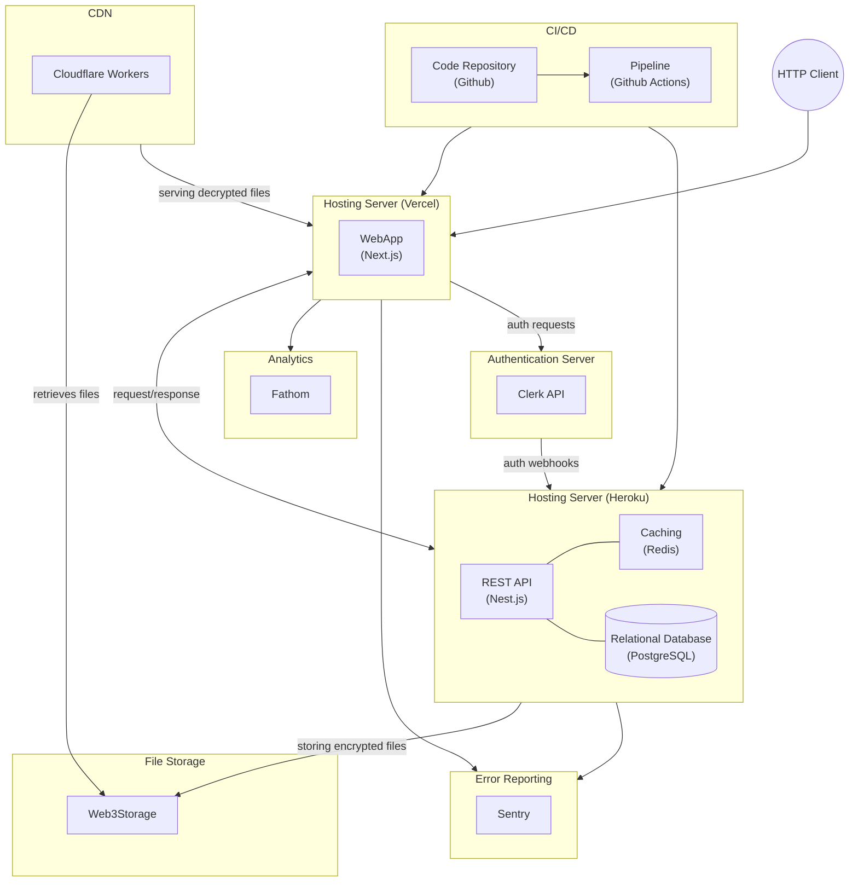

# Architecture Diagram

```mermaid
flowchart TB
    %%{ init: { 'flowchart': { 'curve': 'bump' } } }%%

    subgraph CI/CD
        cd["Code Repository\n(Github)"]
        pl["Pipeline\n(Github Actions)"]
        cd --> pl
    end

    subgraph HSWA["#nbsp;#nbsp;Hosting Server (Vercel)#nbsp;#nbsp;"]
        webapp["WebApp\n(Next.js)"]
    end

    subgraph HSAPI["Hosting Server (Heroku)"]
        api["REST API\n(Nest.js)"]
        redis["Caching\n(Redis)"]
        db[("Relational Database\n(PostgreSQL)")]
        api --- redis
        api --- db
    end

    subgraph AS["#nbsp;#nbsp;Authentication Server#nbsp;#nbsp;"]
        clerk["Clerk API"]
    end

    subgraph FS["File Storage"]
        W3S["Web3Storage"]
    end

    subgraph ER["#nbsp;#nbsp;Error Reporting#nbsp;#nbsp;"]
        s1["Sentry"]
    end

    subgraph A1["Analytics"]
        f1["Fathom"]
    end

    subgraph CDN
        CW["Cloudflare Workers"]
    end


    HC(("HTTP Client"))
    CW -- retrieves files --> W3S
    CI/CD --> HSWA
    CI/CD --> HSAPI
    HSWA <-- request/response --> HSAPI
    HSAPI -- storing encrypted files --> W3S
    CDN -- serving decrypted files --> HSWA
    HSWA --> A1
    HSWA --> ER
    HSWA -- auth requests --> AS
    HC --> HSWA
    HSAPI --> ER
    AS -- auth webhooks --> HSAPI
```
