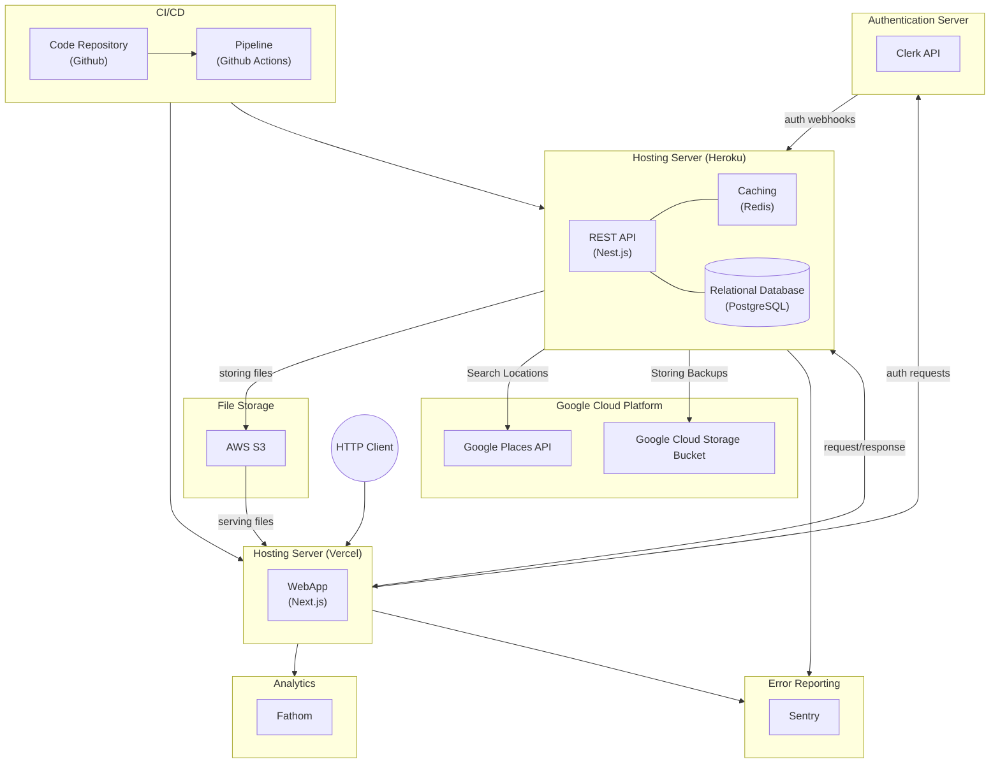

# Architecture Diagram

```mermaid
flowchart TB
    %%{ init: { 'flowchart': { 'curve': 'bump' } } }%%

    subgraph CI/CD
        cd["Code Repository\n(Github)"]
        pl["Pipeline\n(Github Actions)"]
        cd --> pl
    end

    subgraph HSWA["#nbsp;#nbsp;Hosting Server (Vercel)#nbsp;#nbsp;"]
        webapp["WebApp\n(Next.js)"]
    end

    subgraph HSAPI["Hosting Server (Heroku)"]
        api["REST API\n(Nest.js)"]
        redis["Caching\n(Redis)"]
        db[("Relational Database\n(PostgreSQL)")]
        api --- redis
        api --- db
    end

    subgraph AS["#nbsp;#nbsp;Authentication Server#nbsp;#nbsp;"]
        clerk["Clerk API"]
    end

    subgraph FS["File Storage"]
        S3["AWS S3"]
    end

    subgraph ER["#nbsp;#nbsp;Error Reporting#nbsp;#nbsp;"]
        s1["Sentry"]
    end

    subgraph A1["Analytics"]
        f1["Fathom"]
    end

    subgraph GCP["Google Cloud Platform"]
        GCPAPI["Google Places API"]
        GCPBucket["Google Cloud Storage Bucket"]
    end

    HC(("HTTP Client"))
    CI/CD --> HSWA
    CI/CD --> HSAPI
    HSWA <-- request/response --> HSAPI
    HSAPI -- storing files --> S3
    S3 -- serving files --> HSWA
    HSWA --> A1
    HSWA --> ER
    HSWA -- auth requests --> AS
    HSAPI -- Search Locations --> GCPAPI
    HSAPI -- Storing Backups --> GCPBucket
    HC --> HSWA
    HSAPI --> ER
    AS -- auth webhooks --> HSAPI
```
