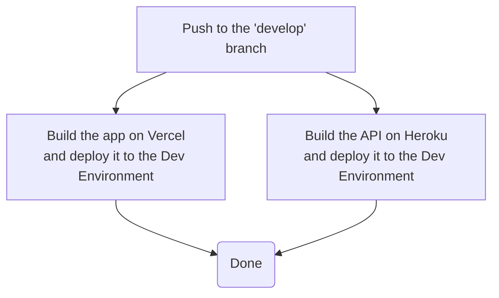

# Dev Deployment

This document outlines the process for deploying code to the development environment.

## Process

- The _Dev Deployment_ workflow runs every time code gets pushed to the `develop` branch
- After running the workflow, the web application will be deployed to [Vercel's Dev Environment](https://dev.plnetwork.io/) and the API to [Heroku's Dev Environment](https://dev-protocol-labs-network-api.herokuapp.com/)

## Workflow

