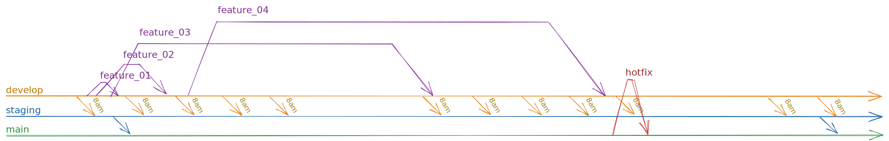

# Branching Guidelines

This document is designed to help developers understand how to properly use Git branches in our development process.

By following these guidelines, we can ensure that our codebase is organized, easy to manage, and free of conflicts.

This document will cover the overall branching strategy and best practices for working with branches.

## Branching Strategy

In our project, we use a Git branching model that allows us to efficiently manage our codebase and keep track of different versions of our code.

The main branches in our project are:

- `develop`:

  - This is the primary branch where developers should be branching off of and merging pull requests to
  - Pushes to this branch trigger deploys to the development environment

- `staging`:

  - This branch serves as a staging area for code that is ready for testing.
  - Code from the `develop` branch is merged into this branch via rebase every day at 8AM (WET)
  - Pushes to this branch trigger deploys to the staging environment
  - When code is pushed to this branch, we also add a new pre-release version (e.g., `v1.5.0-staging.1`) using the `semantic-releases` npm package and a tag identifying the version gets added to the corresponding commit

- `main`:

  - This is the branch where code is deployed to production
  - Code shall be pushed to this branch via a Github action
  - Pushes to this branch trigger deploys to the production environment
  - When code is pushed to this branch, we also add a new release version (e.g., `v1.5.0`) using the `semantic-releases` npm package and a tag identifying the version gets added to the corresponding commit

- feature branches:

  - Developers work on their features, bugfixes, and other tasks in these branches, branched out from the `develop` branch

- hotfix branches:
  - When a hotfix is needed, developers will create a new branch from the `main` branch to work on the hotfix.

### Regular Workflow

To start a new feature or bugfix, developers should create a new branch from the `develop` branch.

The branch should be named following this convention: `type/PL-XXX-description`, where:

- `type` is the type of change being made, and must one of the following values: `build`, `chore`, `ci`, `docs`, `feat`, `fix`, `perf`, `refactor`, `revert`, `style`, or `test`;
- `XXX` is the JIRA ticket number;
- `description` is a short description of the changes being made.

Once the work on the feature or bugfix is complete, the developer should open a pull request to merge their branch into the `develop` branch.

### Hotfix Workflow

For hotfixes, the process is slightly different. Developers should create a new branch from the `main` branch to work on the hotfix, and open a pull request to merge their branch back into the `main` branch.

## Best Practices

- Always branch off of the `develop` branch for feature development and `main` for hotfixes
- Follow the branch naming convention
- Keep feature branches up-to-date by regularly syncing with the `develop` branch
- Write clear and informative commit messages that describe the code changes
- Review and test code changes thoroughly before opening pull requests

## Hotfixes

In the event of a critical bug or security vulnerability found in the production environment, a hotfix branch should be created immediately and branched off of the `main` branch.

The hotfix should be prioritized and developed as quickly as possible to minimize any potential impact to the production environment.

Once the hotfix has been completed and thoroughly tested, it should be merged into the `main` branch, thus deployed to production immediately.

A GitHub Action is configured for the corresponding changes to get merged into the `staging` and `develop` branches to ensure that the issue is also resolved in the development and staging environments.

A release gets created and the commit gets tagged with the appropriate version, using the `semantic-releases` npm package.

After the hotfix is deployed, a JIRA ticket should be created to track the issue and any follow-up work that may be required.

## Branch Protection

In order to maintain the integrity of the `main`, `staging`, and `develop` branches, all changes must be made through pull requests and must be approved by at least one team member before being merged.

Additionally, pull requests to these branches must receive approval from at least one code owner to ensure that changes are being reviewed by someone who is familiar with the codebase and can accurately assess the impact of the proposed changes.

In order to prevent stale pull request approvals, any approvals that are given on a pull request will be dismissed when new commits are pushed to the branch.

Before a pull request can be merged, all status checks must pass. This includes checks such as linting, testing, and code format validation.

In order to prevent conflicts, branches must be up-to-date with the latest changes made on the `develop` branch before merging. This ensures that the codebase remains consistent and that any conflicts are resolved beforehand.
