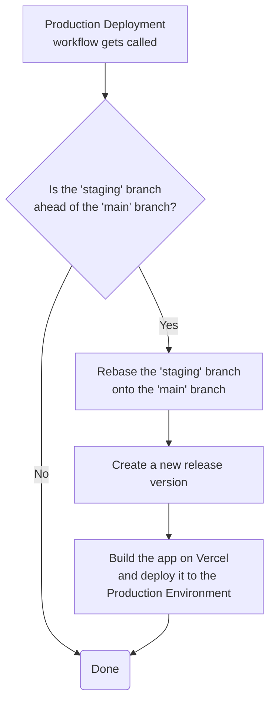

# Production Deployment

## Process

- The Production Deployment\_ workflow can be triggered ad-hoc by either running the workflow:
  - directly from the repository's _Actions_ panel
  - using the _npm_ script `yarn run deploy:production`
- After running the workflow, the web application will be deployed to [Vercel's Production Environment](https://plnetwork.io/)

## Workflow

