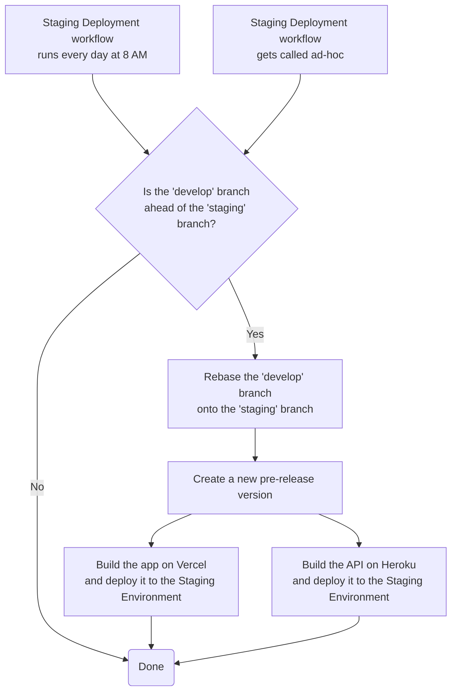

# Staging Deployment

## Process

- The _Staging Deployment_ workflow:
  - runs every day at 8 AM
  - can be triggered ad-hoc by either running the workflow:
    - directly from the repository's _Actions_ panel
    - using the _npm_ script `yarn run deploy:staging`
- After running the workflow, the web application will be deployed to [Vercel's Staging Environment](https://staging.plnetwork.io/) and the API to [Heroku's Staging Environment](https://stag-protocol-labs-network-api.herokuapp.com/)

## Workflow

