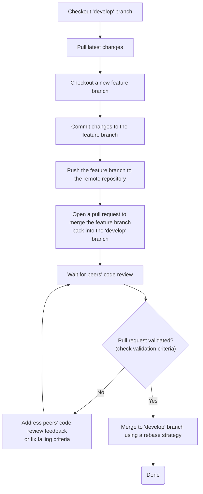

# Development Workflow

```mermaid
flowchart TD
  A[Checkout 'develop' branch] --> B[Pull latest changes]
  B --> C[Checkout a new feature branch]
  C --> D[Commit changes to the feature branch]
  D --> E[Push the feature branch to the remote repository]
  E --> F[Open a pull request to merge the feature branch\nback into the 'develop' branch]
  F --> G[Wait for peers' code review]
  G --> H{"Pull request validated?\n(check validation criteria)"}
  H --> |No| K[Address peers' code review feedback\nor fix failing criteria]
  K --> G
  H --> |Yes| I["Merge to 'develop' branch using a rebase strategy"]
  I --> L(Done)
```
